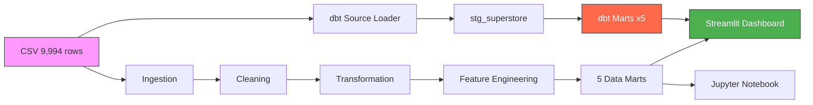
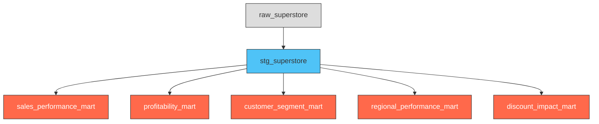

# Superstore Executive Performance & Profitability Review

### End-to-End Data Engineering + BI Portfolio Project

[](https://github.com/AugustoTonelli14/superstore-analysis/actions)


---

## Project Overview

A **production-grade data pipeline and analytics platform** built on the Sample Superstore dataset (9,994 retail transactions across 2014-2017). The project demonstrates the full lifecycle of data engineering: ingestion, cleaning, transformation, analytics modeling, interactive dashboarding, and CI/CD automation.

Three parallel analytical paths process the same data, showcasing fluency across paradigms:

- **Python pipeline** (pandas) — modular ETL with 57 pytest tests
- **SQL pipeline** (DuckDB) — pure SQL analytics on the same schema
- **dbt pipeline** (dbt-core + dbt-duckdb) — staging models, 5 data marts, 26 schema tests

---

## Pipeline Architecture



### dbt Lineage



---

## Business Questions Answered

1. **Where is the business making and losing money?** — Category, sub-category, and product-level profitability analysis
2. **Is the discounting strategy sound?** — Threshold analysis of discount bands vs profit destruction
3. **Which geographies are underperforming?** — State and regional profitability with loss concentration mapping
4. **Which customer segments deserve investment?** — Segment-level margin quality and discount behaviour
5. **What operational patterns compound underperformance?** — Shipping mode efficiency and lead time analysis
6. **What should management do?** — Prioritised, evidence-based strategic action framework

---

## Key Findings

| Finding | Insight |
|---------|---------|
| **High-discount orders destroy $135K/yr** | Orders with discounts >=30% have an 80%+ loss rate in Furniture |
| **Tables and Bookcases are structurally loss-making** | Loss-making at nearly every discount level; pricing reform is required |
| **4 states destroy $71.9K combined** | Texas, Ohio, Pennsylvania, and Illinois are net value destroyers |
| **Technology drives 51% of profit on 36% of revenue** | The business's most scalable engine |
| **The Central region underperforms by 4+ margin points** | 8% margin vs 12.5% company average |
| **18.7% of all order lines lose money** | Nearly 1 in 5 transactions destroys value |

---

## Project Structure

```
superstore-analysis/
├── .github/workflows/
│   └── ci.yml                      ← GitHub Actions: lint → test → pipeline-smoke
│
├── data/
│   ├── raw/                        ← Original CSV (source of truth)
│   ├── processed/                  ← Cleaned dataset
│   └── marts/                      ← 5 analytical data marts
│
├── dbt/
│   ├── models/
│   │   ├── staging/
│   │   │   ├── stg_superstore.sql  ← Staging model with 15+ derived columns
│   │   │   └── schema.yml          ← Data tests: unique, not_null, accepted_values
│   │   ├── marts/
│   │   │   ├── *_mart.sql          ← 5 mart models
│   │   │   └── schema.yml          ← Mart-level data tests
│   │   └── sources.yml
│   ├── load_source.py              ← CSV → DuckDB loader (pre-dbt step)
│   ├── profiles.yml
│   └── dbt_project.yml
│
├── notebooks/
│   └── superstore_analysis.ipynb   ← Consulting-style analytical report
│
├── scripts/
│   └── generate_scale_data.py      ← Synthetic 500K-row data generator
│
├── src/
│   ├── ingestion.py                ← Schema validation + CSV loading
│   ├── cleaning.py                 ← Deduplication, date parsing, validation
│   ├── transformation.py           ← Time features, shipping lead time
│   ├── feature_engineering.py      ← Business metrics (margin %, discount bands, flags)
│   ├── marts.py                    ← 5 analytical data mart builders
│   └── utils.py                    ← Shared helpers, plot style, KPI functions
│
├── sql/
│   ├── queries/*.sql               ← SQL equivalents of every data mart
│   └── run_sql_pipeline.py         ← Executes all SQL queries via DuckDB
│
├── tests/
│   ├── conftest.py                 ← Shared fixtures
│   ├── test_ingestion.py
│   ├── test_cleaning.py
│   ├── test_transformation.py
│   ├── test_feature_engineering.py
│   └── test_marts.py               ← 57 tests total
│
├── dashboard.py                    ← Interactive Streamlit dashboard (8 sections)
├── pipeline.py                     ← Entry point (supports USE_SCALED_DATA=1)
├── Makefile                        ← make lint | test | pipeline | dbt-run | ...
├── pyproject.toml                  ← ruff + pytest config
└── requirements.txt
```

---

## Data Marts

Each mart is built in **three implementations** — Python (pandas), SQL (DuckDB), and dbt (dbt-duckdb) — demonstrating fluency across paradigms.

| Mart | Purpose | Supports |
|------|---------|---------|
| `sales_performance_mart` | Monthly/yearly revenue and volume trends | Budget planning, campaign timing |
| `profitability_mart` | Margin by category, sub-category, product | Product rationalisation, pricing |
| `customer_segment_mart` | Performance by segment | Sales force allocation, retention |
| `regional_performance_mart` | Sales and profit by region and state | Territory planning, resource allocation |
| `discount_impact_mart` | Profitability by discount band and category | Discount policy design |

---

## Scalability

The pipeline is designed to handle real-world data volumes. A synthetic data generator creates a **500,000-row dataset** mirroring the same schema, distributions, and edge cases:

```bash
python scripts/generate_scale_data.py --rows 500000   # generate synthetic data
USE_SCALED_DATA=1 python pipeline.py                   # run pipeline at 50x scale
```

The entire pipeline (ingestion → marts) processes 500K rows end-to-end on a single machine.

---

## CI/CD

GitHub Actions runs three jobs on every push and PR:

| Job | What it checks |
|-----|---------------|
| **Lint** | `ruff check .` — zero tolerance on style violations |
| **Test** | `pytest tests/ -v` — 57 unit tests across all pipeline stages |
| **Pipeline Smoke** | Full Python + SQL pipeline execution, verifies all 5 mart CSVs exist |

---

## Skills Demonstrated

| Skill | Where it shows up |
|-------|------------------|
| **Python (pandas, NumPy)** | Modular ETL in `src/`, 33+ engineered features |
| **SQL (DuckDB)** | 5 mart queries in `sql/queries/`, hybrid pandas+DuckDB loader |
| **dbt (dbt-core + dbt-duckdb)** | Staging model, 5 mart models, 26 schema tests in `dbt/` |
| **Data Modeling** | Star-schema-inspired marts with clean separation of concerns |
| **Testing (pytest)** | 57 tests covering every pipeline stage, shared fixtures |
| **CI/CD (GitHub Actions)** | 3-job workflow: lint, test, pipeline smoke |
| **Dashboarding (Streamlit)** | 8-section executive dashboard with dbt model explorer |
| **Data Visualization (matplotlib)** | 10+ publication-ready charts in notebook + dashboard |
| **Business Intelligence** | Consulting-style findings tied to strategic recommendations |
| **Synthetic Data Generation** | Realistic 500K-row generator with configurable distributions |

---

## How to Run

### 1. Clone and install
```bash
git clone https://github.com/AugustoTonelli14/superstore-analysis.git
cd superstore-analysis
pip install -r requirements.txt
```

### 2. Run the pipeline
```bash
python pipeline.py                    # Python pipeline (9,994 rows → 5 marts)
python sql/run_sql_pipeline.py        # SQL pipeline (same marts, pure SQL)
```

### 3. Run dbt
```bash
python dbt/load_source.py             # load CSV into DuckDB
cd dbt && dbt run --profiles-dir .    # build all models
cd dbt && dbt test --profiles-dir .   # run 26 schema tests
```

### 4. Launch the dashboard
```bash
streamlit run dashboard.py
```

### 5. Open the notebook
```bash
jupyter notebook notebooks/superstore_analysis.ipynb
```

### 6. Run quality checks
```bash
ruff check .                          # lint (zero errors expected)
pytest tests/ -v                      # 57 tests
```

### 7. Scale test
```bash
python scripts/generate_scale_data.py
USE_SCALED_DATA=1 python pipeline.py
```

---

## Strategic Recommendations

1. **Implement a three-tier discount approval matrix** — discounts above 30% require VP sign-off
2. **Conduct territory-level loss investigations** for Texas, Ohio, Pennsylvania, and Illinois
3. **Review Furniture portfolio pricing** — Tables and Bookcases require price increases or supplier renegotiation
4. **Protect Technology margins** — impose a 20% discount ceiling on all Technology sub-categories
5. **Redesign sales incentives** to reward margin-adjusted revenue, not gross revenue

---

*Built as a portfolio project demonstrating end-to-end data engineering, SQL analytics, dbt modeling, interactive dashboarding, CI/CD automation, and executive communication skills.*
